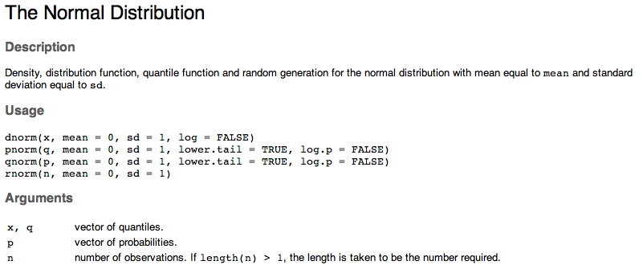

## За мен

- Съосновател на Intuitics/StatAce
- От 2.5 години разработваме софтуер на базата на R
- Бизнес образование
- Опит с анализ на данни в Agilent Technologies, HP, и университета

---

## Какво е R

- R е език за статистическо програмиране = програмен език с изчислителна и графична насока
- Диалект на комерсиалните езици S и S-Plus (сега собственост на Tibco)
- Започнат през 1993 от Robert Gentleman и Ross Ihaka в университета в Оукланд, Нова Зенландия
- Ползва се от над 2 милиона потребителя
- Растежа се забърва последните няколко години, преминавайки от академичните среди към бизнеса

---

## Предимства

- Пълен набор от фукнции за целия процес на анализа, от свързването към данни до комуникирането на резултати
- Повече от 6000 допълнителни пакета. R често получава най-новите анализи първи.
- Много добри графични способности
- Безплатен, с отворен код
- Няколко комерсиални предложения
- Изключително активна общност
- Напълно функционален програмен език

---

## Популярност


---

## Растеж на броя на R пакетите


---

## Недостатъци

- Сравнително труден за научаване
- Сравнително слаби графични интерфейси
- Документацията не е винаги ясна или пълна
- Не всички пакети са с добро качество
- Много начини за постигане на една и съща цел
- В много случай ограничен от достъпната памет (RAM)
- Липса на вградена паралелизация

---

## Сравнение с конкуренцията

|                      | R           | SAS         | SPSS           | Matlab               | Python      |
|----------------------|-------------|-------------|----------------|----------------------|-------------|
| Цена                 | Безплатен   | Много скъп  | Скъп           | Скъп                 | Безплатен   |
| Нови функции         | Бързо       | Бавно       | Бавно          | Бавно                | Средно      |
| Насока               | Широка      | Широка      | Социални науки | Инженерни науки + ML | Широка      |
| Леснота на учене     | Труден      | Среден      | Лесен          | Лесен                | Среден      |
| Графични способности | Много добри | Средни      | Средни         | Добри                | Средни      |
| Работа с данни       | Добра       | Много добра | Слаба          | Добра                | Много добра |

---

## Развитие

- Бърз разтеж, ползва се от фирми като Google, Facebook, Twitter, Amazon, Netflix, Microsoft, Expedia, Dell, HP, и много други
- По-достъпни пакети с богат набор от функции (dplyr, reshape2, caret, и т.н.)
- Често се ползва за прототипиране, след което анализа се пренаписва с Java, Python и т.н.
- Допълва се с Python за събиране и обработка на данни, както и за анализ на текст
- Сериозни усилия за премахване на ограниченията с паметта и процесора

---

## Въведение в езика

- R се ползва през интерактивна конзола (често RStudio)
- Ползва къдрави скоби като C, Java и JavaScript
- Като цяло е функционален програмен език = съставен от функции които приемат обекти. Обектите рядко имат функции.
- Пример:
<!-- collapse=TRUE -->
  ```{r, collapse = T, comment = "#"}
  "Hello world"
  1234
  1 + 2
  ```

---

## Видове обекти

- Има няколко основни вида обекти в R. Всеки обект има клас (`class()`)
- Нулева стойност (`NULL`)
- Вектор - редица от примитивни структури (липсващи стойности = `NA`):
  - Двоични, TRUE/FALSE или T/F (`logical`)
  - Числа: дробни (`numeric`), цели (`integer`), комплексни (`complex`)
  - Текст (`character`) и фактор/категория (`factor`, `ordered.factor`)
  - Дата до ден (`Date`) и до секунда (`POSIXt`)
- Матрица (`matrix`): 2-измерен вектор
- Масив (`array`): вектор в 2 или повече измерения
- Списък (`list`): съдържа произволни други обекти (всеки има индекс + евентуално име)
- Таблица (`data.frame`): списък който съдържа само вектори с еднаква дължина

---

## Задаване на стойност на променливи

- Оператора за задание е `<-` (може да се ползва и `=` но не е препоръчано)
- Изпълнението само на име на променлива връща нейната стойност

  ```{r, collapse = T, comment = "#"}
  hello <- "Здравей"
  hello
  ```

- `hello` е текстов вектор с дължина 1:

  ```{r, collapse = T, comment = "#"}
  class(hello)
  length(hello)
  ```

---

## Помощ за функция

`? ф` и `help(ф)` показват документацията на функция, `example(ф)` показва примери:

```
? rnorm или help(rnorm)
```



---

## Търсене в документацията

Tърсете в документацията с `?? термин`:

```
?? random
```


---

## Задаване на стойност на функции

- В R може да се зададе стойност на функция
- Пример: елементите във вектор могат да имат имена (текстов вектор):

  ```{r, collapse = T, comment = "#"}
  names(hello)
  ```
  
- Задаване на имена:

  ```{r, collapse = T, comment = "#"}
  names(hello) <- "Това е R"
  hello
  names(hello)
  ```

---

## Работа с обекти

- Имената на обекти могат да съдържат букви, цифри, `.` и `_`. Конвенция: data.frame, as.list
- Отделните елементи на всеки обект се достигат с квадратни скоби (`[...]`). Индексите винаги започват от 1.
- Функция `c()` създава/комбинира вектор с повече от един елемент:

  ```{r, collapse = T, comment = "#"}
  hello.vector <- c(hello, "Нова стойност")
  hello.vector
  names(hello.vector)[2] <- "Ново име"
  hello.vector
  hello.vector[2]
  ```

--- &twocol_left

## Работа с обекти (2)

Всеки обект може да има атрибути, които се съхраняват в списък по име

*** =left

Класовете на обектите са атрибут, както и имената на елементите във вектор и нивата на фактор:

```{r, collapse = T, comment = "#"}
attributes(hello.vector)
attributes(as.factor(hello.vector))
```

*** =right

Можете да добавяте свои атрибути:

```{r, collapse = T, comment = "#"}
attr(hello.vector, "my.attribute") <- "А"
attributes(hello.vector)
```

---

## Работа с вектори

- Конструкцията `X:Y` създава вектор от `X` до `Y` (растящ или намаляващ)
- Разлики в класовете:

  ```{r, collapse = T, comment = "#"}
  numbers <- c(-1:1, rnorm(n = 3, mean = 3, sd = 10))
  numbers
  class(numbers)
  as.integer(numbers)
  as.character(numbers)
  as.logical(numbers)
  ```

---

## Операции с вектори

- Векторните операции винаги се извършват върху всички елементи:

  ```{r, collapse = T, comment = "#"}
  vec <- 1:10
  vec * 2
  vec + 2
  ```
- Когато единият вектор е по-къс, той се преизползва от началото:

  ```{r, collapse = T, comment = "#"}
  multiply <- c(2, 3)
  vec * multiply
  ##    = 1  2  3  4  5  6...
  ##    * 2  3  2  3  2  3...
  ```

--- &twocol_left

## Работа с матрици

Матрицата представлява вектор, с дефиниран брой редове и колони, и може да бъде достъпна като вектор (с `[x]`). Броят на редовете и колоните се съхранява в атрибута `dim`.

*** =left

Създава се и се манипулира по колона, елементи се избират с `[колони, редове]`

```{r, collapse = T, comment = "#"}
mat <- matrix(1:4, nrow = 2); mat
mat[2, 1]
mat[2,]
mat[, 2]
mat[4]
```

*** =right

`byrow` обръща реда на създаване и достъп (по ред, `[редове, колони]`)

```{r, collapse = T, comment = "#"}
mat <- matrix(1:4, 2, byrow = T); mat
mat[2, 1]
mat[2,]
mat[, 2]
```

--- &twocol_left

## Операции с матрици

Матричните операции се извършват:

*** =left

### Нормално (като вектори)

```{r, collapse = T, comment = "#"}
mat
mat * mat
mat + 2
```

*** =right

### Нормално (като вектори)

```{r, collapse = T, comment = "#"}
mat ^ mat
```

### Не толкова (като матрици)

```{r, collapse = T, comment = "#"}
mat %*% mat
```

--- &twocol_left_width

## Списъци

Списъкът представлява масив от други обекти. С `[x]` се създава нов списък само с желаните елементи. С `[[x]]` или `$` се достига отделен елемент.

*** =left width:48%

```{r, collapse = T, comment = "#"}
my.list <- list(Numbers = 1:5,
           Names = c("Иван", "Петя"),
           Date = Sys.Date()); my.list
my.list$Date
```

*** =right width:48%

```{r, collapse = T, comment = "#"}
my.list[c(2, 3)]
my.list["Names"]
my.list[["Names"]]
my.list[[3]]
```

--- &twocol_left_width

## Таблици

- Таблицата е списък от вектори с еднаква дължина
- Всеки ред може да има име, което е достъпно и може да се променя чрез `names()`
- С `[колони]` се създава нова таблица с желаните колони. С `[ред, колона]` се достига една клетка. С `[[колона]]` или `$` се достига вектора на колона.

*** =left width:48%

```{r, collapse = T, comment = "#"}
df <- data.frame(Age = c(29, 34),
      Gender = as.factor(c("M", "F")),
      row.names = c("Иван", "Петя"))
df
df[2]
```

*** =right width:48%

```{r, collapse = T, comment = "#"}
df[[2]]
class(df[[2]])
unclass(df[[2]])
df[2, 1]
```

---

## Екосистема

- Графични интерфейси: RStudio, R Commander, Rattle, Deducer, 
- Създаване на доклади: RMarkdown, IPython, Knitr, Sweave
- Интерактивни уеб апликации: Shiny, Intuitics
- Скалируемост: H20 (система базирана на Hadoop), rmr2 (Hadoop MapReduce)
- Интерпретатори:
  - Комерсиални: Revolution Analytics, Tibco TERR, HP Distributed R, Teradata Aster R, Oracle R Enterprise
  - С отворен код: Pretty Quick R, Renjin, Riposte, CXXR, FastR

---

## Екосистема (2)
  
- Пакети за паралелизация: multicore, snowfall/snow, Rmpi/pdbMPI
- Графични пакети: ggplot2, ggvis, googleVis, rCharts, lattice
- Работа с данни:
  - Свързване: RCurl, ROracle, RMySQL, RODBC, RPostgreSQL, RMongo, RSQLite, rhdfs, rhbase
  - Транформация: dplyr/plyr, reshape2, sqldf
  - Големи данни: ff, database, bigmemory, bigalgebra и приятели
- Продуктизиране: OpenCPU, rApache, rServe
- Други: slidify (тази презентация), animation, audio, rgl (3D графики), httpuv (HTTP сървър)

--- &twocol_left_width

## Ще анализираме червени и бели вина!

- Данни от https://archive.ics.uci.edu/ml/datasets/Wine+Quality
- Получаваме два файла - един с бели и един с червени вина
- Целта е да установим как химичните съставки определят качеството на виното


*** =left width:48%
- Колони (12):
  - fixed acidity 
  - volatile acidity 
  - citric acid 
  - residual sugar 
  - chlorides 
  - free sulfur dioxide 
  - total sulfur dioxide 
  
*** =right width:48%
- Колони (продължение):
  - density 
  - pH 
  - sulphates 
  - alcohol 
  
- Изходна стойност
  - quality (от 0 до 10)

---

## Зареждане на данните

```{r, collapse = T, comment = "#"}
data.red <- read.csv("winequality-red.csv", header = T, sep =";")
head(data.red, 1)
data.white <- read.csv("winequality-white.csv", header = T, sep =";")
head(data.white, 1)
```

---

## Добавяне на типа вино в таблицата

```{r, collapse = T, comment = "#"}
data.red <- transform(data.red, type = "red")
head(data.red, 1)
data.white <- transform(data.white, type = "white")
head(data.white, 1)
```

---

## Обединяване на данните

```{r, collapse = T, comment = "#"}
data <- rbind(data.red, data.white)
data[c(1, 2000), ]
```

---

## Как се филтрират редове и колони

```{r, collapse = T, comment = "#", warning = F}
library(dplyr)
nrow(data)
data.red <- filter(data, type == "red")
ncol(data.red)
names(data.red)[13]
data.red <- select(data.red, -type)
ncol(data.red)
```

За сравнение, филтрирането и махането на колона без dplyr:

```
data.red <- data[data$type == "red", ]
data.red <- data.red[, -which(names(data.red) == "type")]
```

---

## Подготвяне на данни за плотове

```{r, collapse = T, comment = "#", warning = F}
library(reshape2)
data.red <- select(filter(data, type == "red"), -type)
data.white <- select(filter(data, type == "white"), -type)
data.red.for.plot <- melt(data.red, id.vars = NULL)
data.white.for.plot <- melt(data.red, id.vars = NULL)
data.red.for.plot[1:7, ]
```

--- &twocol_left_width

## Плотове на червени вина

*** =left width:38%

```{r, collapse = T, comment = "#", eval = F}
library(ggplot2)
ggplot(data.red.for.plot,
    aes(x = value)) + 
    facet_wrap(~variable,
       scales = "free_x") + 
    geom_histogram()
```

*** =right width:58%

```{r, echo = F, warning = F}
library(ggplot2)
p <- ggplot(data.red.for.plot, aes(x = value)) + 
    facet_wrap(~variable, scales = "free_x") + 
    geom_histogram()
suppressMessages(print(p))
```

---

## Обобщаващи данни

```{r, collapse = T, comment = "#", eval = F}
library(psych);
describe(data.red)
```

```{r, collapse = T, comment = "#", echo = F, warning = F}
suppressMessages(library(psych))
suppressMessages(library(pander))
describe(data.red)
```

<!-- pander(, style = 'rmarkdown', split.cells = Inf) -->


--- &twocol_left_width

## Плот на sulphates на червени вина

*** =left width:38%

```{r, collapse = T, comment = "#", eval = F}
data.red.sulphates = filter(
  data.red.for.plot, 
  variable == "sulphates")
ggplot(data.red.for.plot,
  aes(x = value))
  + geom_histogram()
```

*** =right width:58%

```{r, echo = F, warning = F}
data.red.sulphates = filter(data.red.for.plot, variable == "sulphates")
p <- ggplot(data.red.sulphates, aes(x = value)) + geom_histogram()
suppressMessages(print(p))
```

---

## Филтриране на силно отличаващи се стойности (outliers)

```{r, collapse = T, comment = "#", warning = F}
nrow(data.red)
data.red = filter(data.red, sulphates < 1.5)
nrow(data.red)
```

--- &twocol_left_width

## Проверка за колинеарност

*** =left width:38%

```{r, collapse = T, comment = "#", eval = F}
library(corrplot)
corrs <- cor(data.red,
    use="complete.obs")
corrplot(corrs,
    method= "circle")
```

*** =right width:58%

```{r, collapse = T, comment = "#", echo = F, warning = F}
library(corrplot)
corrs <- cor(data.red, use="complete.obs")
corrplot(corrs, method= "number")
```

---

## Кoмбинираме стойности

```{r, collapse = T, comment = "#", warning = F}
data.red <- mutate(data.red,
                   acidity.density = (fixed.acidity + citric.acid + density - pH) / 3,
                   sulfur.dioxide = (free.sulfur.dioxide + total.sulfur.dioxide) / 2)
data.red <- select(data.red, -c(fixed.acidity, citric.acid, density, 
                   free.sulfur.dioxide, total.sulfur.dioxide, pH))
head(data.red, 3)
```

--- &twocol_left_width

## Проверка за колинеарност (отново)

*** =left width:38%

```{r, collapse = T, comment = "#", eval = F}
library(corrplot)
corrs <- cor(data.red,
    use="complete.obs")
corrplot(corrs,
    method= "circle")
```

*** =right width:58%

```{r, collapse = T, comment = "#", echo = F, warning = F}
library(corrplot)
corrs <- cor(data.red, use="complete.obs")
corrplot(corrs, method= "number")
```

---

## Линеен регресионен модел

```{r, collapse = T, comment = "#", warning = F, eval = F}
model <- lm(quality ~ volatile.acidity + residual.sugar + chlorides + sulphates +
          alcohol + acidity.density + sulfur.dioxide, data = data.red)
summary(model)
```

--- &twocol_left_width

## Линеен регресионен модел (резултат)

```{r, collapse = T, comment = "#", echo = F, results='asis'}
model <- lm(quality ~ volatile.acidity + residual.sugar + chlorides + sulphates +
          alcohol + acidity.density + sulfur.dioxide, data = data.red)
library(xtable)
print(xtable(summary(model)), type = "html")
```

Имаме няколко променливи с добри показатели:

*** =left width:48%

- volatile.acidity
- chlorides
- sulphates

*** =right width:48%

- alcohol
- acidity.density
- sulfur.dioxide

---

## Класификационен модел

Трябва да групираме качеството на вината:

```{r, collapse = T, comment = "#"}
data.red <- mutate(data.red, quality.group = cut(quality, c(1, 4, 6, 10)))
head(data.red, 3)
table(data.red$quality.group)
```

--- &twocol_left_width

## Класификационен модел (2)

*** =left width:42%

```{r, collapse = T, comment = "#", eval = F}
library(rpart)
library(rpart.plot)
model <- rpart(quality.group ~
  volatile.acidity +
  residual.sugar +
  chlorides + sulphates +
  alcohol + acidity.density +
  sulfur.dioxide,
  data = data.red)
prp(model)
```

*** =right width:54%

```{r, collapse = T, comment = "#", echo = F, warning = F}
library(rpart)
library(rpart.plot)
data.red <- mutate(data.red, quality.group = cut(quality, c(0, 5, 6, 11)))
model <- rpart(quality.group ~ volatile.acidity + residual.sugar + chlorides + sulphates + alcohol + acidity.density + sulfur.dioxide, data = data.red)
prp(model)
```

---

## Благодаря!

<div style="height: 400px">&#160;</div>

Кристиан Младенов

christian@intuitics.com

Презентация с код + данни: www.github.com/zhvihti

