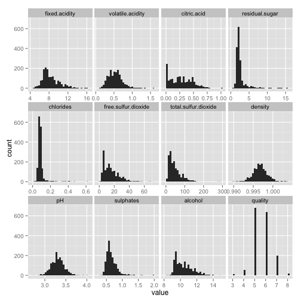
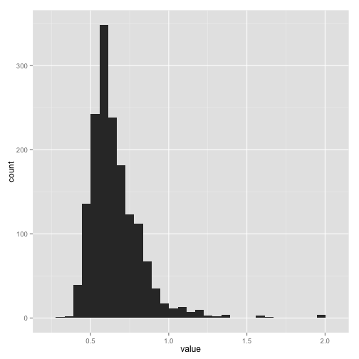
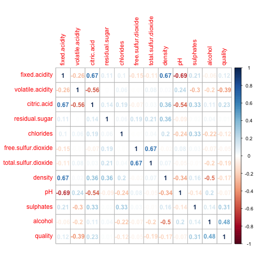
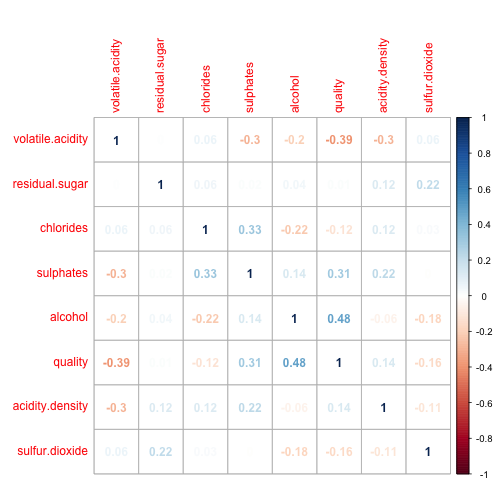
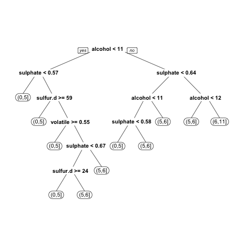

## За мен

- Съосновател на Intuitics/StatAce
- От 2.5 години разработваме софтуер на базата на R
- Бизнес образование
- Опит с анализ на данни в Agilent Technologies, HP, и университета

---

## Какво е R

- R е език за статистическо програмиране = програмен език с изчислителна и графична насока
- Диалект на комерсиалните езици S и S-Plus (сега собственост на Tibco)
- Започнат през 1993 от Robert Gentleman и Ross Ihaka в университета в Оукланд, Нова Зенландия
- Ползва се от над 2 милиона потребителя
- Растежа се забърва последните няколко години, преминавайки от академичните среди към бизнеса

---

## Предимства

- Пълен набор от фукнции за целия процес на анализа, от свързването към данни до комуникирането на резултати
- Повече от 6000 допълнителни пакета. R често получава най-новите анализи първи.
- Много добри графични способности
- Безплатен, с отворен код
- Няколко комерсиални предложения
- Изключително активна общност
- Напълно функционален програмен език

---

## Популярност


---

## Растеж на броя на R пакетите


---

## Недостатъци

- Сравнително труден за научаване
- Сравнително слаби графични интерфейси
- Документацията не е винаги ясна или пълна
- Не всички пакети са с добро качество
- Много начини за постигане на една и съща цел
- В много случай ограничен от достъпната памет (RAM)
- Липса на вградена паралелизация

---

## Сравнение с конкуренцията

|                      | R           | SAS         | SPSS           | Matlab               | Python      |
|----------------------|-------------|-------------|----------------|----------------------|-------------|
| Цена                 | Безплатен   | Много скъп  | Скъп           | Скъп                 | Безплатен   |
| Нови функции         | Бързо       | Бавно       | Бавно          | Бавно                | Средно      |
| Насока               | Широка      | Широка      | Социални науки | Инженерни науки + ML | Широка      |
| Леснота на учене     | Труден      | Среден      | Лесен          | Лесен                | Среден      |
| Графични способности | Много добри | Средни      | Средни         | Добри                | Средни      |
| Работа с данни       | Добра       | Много добра | Слаба          | Добра                | Много добра |

---

## Развитие

- Бърз разтеж, ползва се от фирми като Google, Facebook, Twitter, Amazon, Netflix, Microsoft, Expedia, Dell, HP, и много други
- По-достъпни пакети с богат набор от функции (dplyr, reshape2, caret, и т.н.)
- Често се ползва за прототипиране, след което анализа се пренаписва с Java, Python и т.н.
- Допълва се с Python за събиране и обработка на данни, както и за анализ на текст
- Сериозни усилия за премахване на ограниченията с паметта и процесора

---

## Въведение в езика

- R се ползва през интерактивна конзола (често RStudio)
- Ползва къдрави скоби като C, Java и JavaScript
- Като цяло е функционален програмен език = съставен от функции които приемат обекти. Обектите рядко имат функции.
- Пример:
<!-- collapse=TRUE -->
  
  ```r
  "Hello world"
  # [1] "Hello world"
  1234
  # [1] 1234
  1 + 2
  # [1] 3
  ```

---

## Видове обекти

- Има няколко основни вида обекти в R. Всеки обект има клас (`class()`)
- Нулева стойност (`NULL`)
- Вектор - редица от примитивни структури (липсващи стойности = `NA`):
  - Двоични, TRUE/FALSE или T/F (`logical`)
  - Числа: дробни (`numeric`), цели (`integer`), комплексни (`complex`)
  - Текст (`character`) и фактор/категория (`factor`, `ordered.factor`)
  - Дата до ден (`Date`) и до секунда (`POSIXt`)
- Матрица (`matrix`): 2-измерен вектор
- Масив (`array`): вектор в 2 или повече измерения
- Списък (`list`): съдържа произволни други обекти (всеки има индекс + евентуално име)
- Таблица (`data.frame`): списък който съдържа само вектори с еднаква дължина

---

## Задаване на стойност на променливи

- Оператора за задание е `<-` (може да се ползва и `=` но не е препоръчано)
- Изпълнението само на име на променлива връща нейната стойност

  
  ```r
  hello <- "Здравей"
  hello
  # [1] "Здравей"
  ```

- `hello` е текстов вектор с дължина 1:

  
  ```r
  class(hello)
  # [1] "character"
  length(hello)
  # [1] 1
  ```

---

## Помощ за функция

`? ф` и `help(ф)` показват документацията на функция, `example(ф)` показва примери:

```
? rnorm или help(rnorm)
```


---

## Търсене в документацията

Tърсете в документацията с `?? термин`:

```
?? random
```


---

## Задаване на стойност на функции

- В R може да се зададе стойност на функция
- Пример: елементите във вектор могат да имат имена (текстов вектор):

  
  ```r
  names(hello)
  # NULL
  ```
  
- Задаване на имена:

  
  ```r
  names(hello) <- "Това е R"
  hello
  #  Това е R 
  # "Здравей"
  names(hello)
  # [1] "Това е R"
  ```

---

## Работа с обекти

- Имената на обекти могат да съдържат букви, цифри, `.` и `_`. Конвенция: data.frame, as.list
- Отделните елементи на всеки обект се достигат с квадратни скоби (`[...]`). Индексите винаги започват от 1.
- Функция `c()` създава/комбинира вектор с повече от един елемент:

  
  ```r
  hello.vector <- c(hello, "Нова стойност")
  hello.vector
  #        Това е R                 
  #       "Здравей" "Нова стойност"
  names(hello.vector)[2] <- "Ново име"
  hello.vector
  #        Това е R        Ново име 
  #       "Здравей" "Нова стойност"
  hello.vector[2]
  #        Ново име 
  # "Нова стойност"
  ```

--- &twocol_left

## Работа с обекти (2)

Всеки обект може да има атрибути, които се съхраняват в списък по име

*** =left

Класовете на обектите са атрибут, както и имената на елементите във вектор и нивата на фактор:


```r
attributes(hello.vector)
# $names
# [1] "Това е R" "Ново име"
attributes(as.factor(hello.vector))
# $names
# [1] "Това е R" "Ново име"
# 
# $levels
# [1] "Здравей"       "Нова стойност"
# 
# $class
# [1] "factor"
```

*** =right

Можете да добавяте свои атрибути:


```r
attr(hello.vector, "my.attribute") <- "А"
attributes(hello.vector)
# $names
# [1] "Това е R" "Ново име"
# 
# $my.attribute
# [1] "А"
```

---

## Работа с вектори

- Конструкцията `X:Y` създава вектор от `X` до `Y` (растящ или намаляващ)
- Разлики в класовете:

  
  ```r
  numbers <- c(-1:1, rnorm(n = 3, mean = 3, sd = 10))
  numbers
  # [1] -1.000000  0.000000  1.000000 17.244798 13.357478  0.469073
  class(numbers)
  # [1] "numeric"
  as.integer(numbers)
  # [1] -1  0  1 17 13  0
  as.character(numbers)
  # [1] "-1"                "0"                 "1"                
  # [4] "17.2447978030495"  "13.357477787566"   "0.469072955032535"
  as.logical(numbers)
  # [1]  TRUE FALSE  TRUE  TRUE  TRUE  TRUE
  ```

---

## Операции с вектори

- Векторните операции винаги се извършват върху всички елементи:

  
  ```r
  vec <- 1:10
  vec * 2
  #  [1]  2  4  6  8 10 12 14 16 18 20
  vec + 2
  #  [1]  3  4  5  6  7  8  9 10 11 12
  ```
- Когато единият вектор е по-къс, той се преизползва от началото:

  
  ```r
  multiply <- c(2, 3)
  vec * multiply
  #  [1]  2  6  6 12 10 18 14 24 18 30
  ##    = 1  2  3  4  5  6...
  ##    * 2  3  2  3  2  3...
  ```

--- &twocol_left

## Работа с матрици

Матрицата представлява вектор, с дефиниран брой редове и колони, и може да бъде достъпна като вектор (с `[x]`). Броят на редовете и колоните се съхранява в атрибута `dim`.

*** =left

Създава се и се манипулира по колона, елементи се избират с `[колони, редове]`


```r
mat <- matrix(1:4, nrow = 2); mat
#      [,1] [,2]
# [1,]    1    3
# [2,]    2    4
mat[2, 1]
# [1] 2
mat[2,]
# [1] 2 4
mat[, 2]
# [1] 3 4
mat[4]
# [1] 4
```

*** =right

`byrow` обръща реда на създаване и достъп (по ред, `[редове, колони]`)


```r
mat <- matrix(1:4, 2, byrow = T); mat
#      [,1] [,2]
# [1,]    1    2
# [2,]    3    4
mat[2, 1]
# [1] 3
mat[2,]
# [1] 3 4
mat[, 2]
# [1] 2 4
```

--- &twocol_left

## Операции с матрици

Матричните операции се извършват:

*** =left

### Нормално (като вектори)


```r
mat
#      [,1] [,2]
# [1,]    1    2
# [2,]    3    4
mat * mat
#      [,1] [,2]
# [1,]    1    4
# [2,]    9   16
mat + 2
#      [,1] [,2]
# [1,]    3    4
# [2,]    5    6
```

*** =right

### Нормално (като вектори)


```r
mat ^ mat
#      [,1] [,2]
# [1,]    1    4
# [2,]   27  256
```

### Не толкова (като матрици)


```r
mat %*% mat
#      [,1] [,2]
# [1,]    7   10
# [2,]   15   22
```

--- &twocol_left_width

## Списъци

Списъкът представлява масив от други обекти. С `[x]` се създава нов списък само с желаните елементи. С `[[x]]` или `$` се достига отделен елемент.

*** =left width:48%


```r
my.list <- list(Numbers = 1:5,
           Names = c("Иван", "Петя"),
           Date = Sys.Date()); my.list
# $Numbers
# [1] 1 2 3 4 5
# 
# $Names
# [1] "Иван" "Петя"
# 
# $Date
# [1] "2015-03-11"
my.list$Date
# [1] "2015-03-11"
```

*** =right width:48%


```r
my.list[c(2, 3)]
# $Names
# [1] "Иван" "Петя"
# 
# $Date
# [1] "2015-03-11"
my.list["Names"]
# $Names
# [1] "Иван" "Петя"
my.list[["Names"]]
# [1] "Иван" "Петя"
my.list[[3]]
# [1] "2015-03-11"
```

--- &twocol_left_width

## Таблици

- Таблицата е списък от вектори с еднаква дължина
- Всеки ред може да има име, което е достъпно и може да се променя чрез `names()`
- С `[колони]` се създава нова таблица с желаните колони. С `[ред, колона]` се достига една клетка. С `[[колона]]` или `$` се достига вектора на колона.

*** =left width:48%


```r
df <- data.frame(Age = c(29, 34),
      Gender = as.factor(c("M", "F")),
      row.names = c("Иван", "Петя"))
df
#      Age Gender
# Иван  29      M
# Петя  34      F
df[2]
#      Gender
# Иван      M
# Петя      F
```

*** =right width:48%


```r
df[[2]]
# [1] M F
# Levels: F M
class(df[[2]])
# [1] "factor"
unclass(df[[2]])
# [1] 2 1
# attr(,"levels")
# [1] "F" "M"
df[2, 1]
# [1] 34
```

---

## Екосистема

- Графични интерфейси: RStudio, R Commander, Rattle, Deducer, 
- Създаване на доклади: RMarkdown, IPython, Knitr, Sweave
- Интерактивни уеб апликации: Shiny, Intuitics
- Скалируемост: H20 (система базирана на Hadoop), rmr2 (Hadoop MapReduce)
- Интерпретатори:
  - Комерсиални: Revolution Analytics, Tibco TERR, HP Distributed R, Teradata Aster R, Oracle R Enterprise
  - С отворен код: Pretty Quick R, Renjin, Riposte, CXXR, FastR

---

## Екосистема (2)
  
- Пакети за паралелизация: multicore, snowfall/snow, Rmpi/pdbMPI
- Графични пакети: ggplot2, ggvis, googleVis, rCharts, lattice
- Работа с данни:
  - Свързване: RCurl, ROracle, RMySQL, RODBC, RPostgreSQL, RMongo, RSQLite, rhdfs, rhbase
  - Транформация: dplyr/plyr, reshape2, sqldf
  - Големи данни: ff, database, bigmemory, bigalgebra и приятели
- Продуктизиране: OpenCPU, rApache, rServe
- Други: slidify (тази презентация), animation, audio, rgl (3D графики), httpuv (HTTP сървър)

--- &twocol_left_width

## Ще анализираме червени и бели вина!

- Данни от https://archive.ics.uci.edu/ml/datasets/Wine+Quality
- Получаваме два файла - един с бели и един с червени вина
- Целта е да установим как химичните съставки определят качеството на виното


*** =left width:48%
- Колони (12):
  - fixed acidity 
  - volatile acidity 
  - citric acid 
  - residual sugar 
  - chlorides 
  - free sulfur dioxide 
  - total sulfur dioxide 
  
*** =right width:48%
- Колони (продължение):
  - density 
  - pH 
  - sulphates 
  - alcohol 
  
- Изходна стойност
  - quality (от 0 до 10)

---

## Зареждане на данните


```r
data.red <- read.csv("winequality-red.csv", header = T, sep =";")
head(data.red, 1)
#   fixed.acidity volatile.acidity citric.acid residual.sugar chlorides
# 1           7.4              0.7           0            1.9     0.076
#   free.sulfur.dioxide total.sulfur.dioxide density   pH sulphates alcohol
# 1                  11                   34  0.9978 3.51      0.56     9.4
#   quality
# 1       5
data.white <- read.csv("winequality-white.csv", header = T, sep =";")
head(data.white, 1)
#   fixed.acidity volatile.acidity citric.acid residual.sugar chlorides
# 1             7             0.27        0.36           20.7     0.045
#   free.sulfur.dioxide total.sulfur.dioxide density pH sulphates alcohol
# 1                  45                  170   1.001  3      0.45     8.8
#   quality
# 1       6
```

---

## Добавяне на типа вино в таблицата


```r
data.red <- transform(data.red, type = "red")
head(data.red, 1)
#   fixed.acidity volatile.acidity citric.acid residual.sugar chlorides
# 1           7.4              0.7           0            1.9     0.076
#   free.sulfur.dioxide total.sulfur.dioxide density   pH sulphates alcohol
# 1                  11                   34  0.9978 3.51      0.56     9.4
#   quality type
# 1       5  red
data.white <- transform(data.white, type = "white")
head(data.white, 1)
#   fixed.acidity volatile.acidity citric.acid residual.sugar chlorides
# 1             7             0.27        0.36           20.7     0.045
#   free.sulfur.dioxide total.sulfur.dioxide density pH sulphates alcohol
# 1                  45                  170   1.001  3      0.45     8.8
#   quality  type
# 1       6 white
```

---

## Обединяване на данните


```r
data <- rbind(data.red, data.white)
data[c(1, 2000), ]
#      fixed.acidity volatile.acidity citric.acid residual.sugar chlorides
# 1              7.4              0.7         0.0            1.9     0.076
# 2000           6.3              0.2         0.4            1.5     0.037
#      free.sulfur.dioxide total.sulfur.dioxide density   pH sulphates
# 1                     11                   34  0.9978 3.51      0.56
# 2000                  35                  107  0.9917 3.46      0.50
#      alcohol quality  type
# 1        9.4       5   red
# 2000    11.4       6 white
```

---

## Как се филтрират редове и колони


```r
library(dplyr)
nrow(data)
# [1] 6497
data.red <- filter(data, type == "red")
ncol(data.red)
# [1] 13
names(data.red)[13]
# [1] "type"
data.red <- select(data.red, -type)
ncol(data.red)
# [1] 12
```

За сравнение, филтрирането и махането на колона без dplyr:

```
data.red <- data[data$type == "red", ]
data.red <- data.red[, -which(names(data.red) == "type")]
```

---

## Подготвяне на данни за плотове


```r
library(reshape2)
data.red <- select(filter(data, type == "red"), -type)
data.white <- select(filter(data, type == "white"), -type)
data.red.for.plot <- melt(data.red, id.vars = NULL)
data.white.for.plot <- melt(data.red, id.vars = NULL)
data.red.for.plot[1:7, ]
#        variable value
# 1 fixed.acidity   7.4
# 2 fixed.acidity   7.8
# 3 fixed.acidity   7.8
# 4 fixed.acidity  11.2
# 5 fixed.acidity   7.4
# 6 fixed.acidity   7.4
# 7 fixed.acidity   7.9
```

--- &twocol_left_width

## Плотове на червени вина

*** =left width:38%


```r
library(ggplot2)
ggplot(data.red.for.plot,
    aes(x = value)) + 
    facet_wrap(~variable,
       scales = "free_x") + 
    geom_histogram()
```

*** =right width:58%

 

---

## Обобщаващи данни


```r
library(psych);
describe(data.red)
```


```
#                      vars    n  mean    sd median trimmed   mad  min
# fixed.acidity           1 1599  8.32  1.74   7.90    8.15  1.48 4.60
# volatile.acidity        2 1599  0.53  0.18   0.52    0.52  0.18 0.12
# citric.acid             3 1599  0.27  0.19   0.26    0.26  0.25 0.00
# residual.sugar          4 1599  2.54  1.41   2.20    2.26  0.44 0.90
# chlorides               5 1599  0.09  0.05   0.08    0.08  0.01 0.01
# free.sulfur.dioxide     6 1599 15.87 10.46  14.00   14.58 10.38 1.00
# total.sulfur.dioxide    7 1599 46.47 32.90  38.00   41.84 26.69 6.00
# density                 8 1599  1.00  0.00   1.00    1.00  0.00 0.99
# pH                      9 1599  3.31  0.15   3.31    3.31  0.15 2.74
# sulphates              10 1599  0.66  0.17   0.62    0.64  0.12 0.33
# alcohol                11 1599 10.42  1.07  10.20   10.31  1.04 8.40
# quality                12 1599  5.64  0.81   6.00    5.59  1.48 3.00
#                         max  range skew kurtosis   se
# fixed.acidity         15.90  11.30 0.98     1.12 0.04
# volatile.acidity       1.58   1.46 0.67     1.21 0.00
# citric.acid            1.00   1.00 0.32    -0.79 0.00
# residual.sugar        15.50  14.60 4.53    28.49 0.04
# chlorides              0.61   0.60 5.67    41.53 0.00
# free.sulfur.dioxide   72.00  71.00 1.25     2.01 0.26
# total.sulfur.dioxide 289.00 283.00 1.51     3.79 0.82
# density                1.00   0.01 0.07     0.92 0.00
# pH                     4.01   1.27 0.19     0.80 0.00
# sulphates              2.00   1.67 2.42    11.66 0.00
# alcohol               14.90   6.50 0.86     0.19 0.03
# quality                8.00   5.00 0.22     0.29 0.02
```

<!-- pander(, style = 'rmarkdown', split.cells = Inf) -->


--- &twocol_left_width

## Плот на sulphates на червени вина

*** =left width:38%


```r
data.red.sulphates = filter(
  data.red.for.plot, 
  variable == "sulphates")
ggplot(data.red.for.plot,
  aes(x = value))
  + geom_histogram()
```

*** =right width:58%

 

---

## Филтриране на силно отличаващи се стойности (outliers)


```r
nrow(data.red)
# [1] 1599
data.red = filter(data.red, sulphates < 1.5)
nrow(data.red)
# [1] 1591
```

--- &twocol_left_width

## Проверка за колинеарност

*** =left width:38%


```r
library(corrplot)
corrs <- cor(data.red,
    use="complete.obs")
corrplot(corrs,
    method= "circle")
```

*** =right width:58%

 

---

## Кoмбинираме стойности


```r
data.red <- mutate(data.red,
                   acidity.density = (fixed.acidity + citric.acid + density - pH) / 3,
                   sulfur.dioxide = (free.sulfur.dioxide + total.sulfur.dioxide) / 2)
data.red <- select(data.red, -c(fixed.acidity, citric.acid, density, 
                   free.sulfur.dioxide, total.sulfur.dioxide, pH))
head(data.red, 3)
#   volatile.acidity residual.sugar chlorides sulphates alcohol quality
# 1             0.70            1.9     0.076      0.56     9.4       5
# 2             0.88            2.6     0.098      0.68     9.8       5
# 3             0.76            2.3     0.092      0.65     9.8       5
#   acidity.density sulfur.dioxide
# 1        1.629267           22.5
# 2        1.865600           46.0
# 3        1.859000           34.5
```

--- &twocol_left_width

## Проверка за колинеарност (отново)

*** =left width:38%


```r
library(corrplot)
corrs <- cor(data.red,
    use="complete.obs")
corrplot(corrs,
    method= "circle")
```

*** =right width:58%

 

---

## Линеен регресионен модел


```r
model <- lm(quality ~ volatile.acidity + residual.sugar + chlorides + sulphates +
          alcohol + acidity.density + sulfur.dioxide, data = data.red)
summary(model)
```

--- &twocol_left_width

## Линеен регресионен модел (резултат)

<!-- html table generated in R 3.1.1 by xtable 1.7-4 package -->
<!-- Wed Mar 11 18:20:25 2015 -->
<table border=1>
<tr> <th>  </th> <th> Estimate </th> <th> Std. Error </th> <th> t value </th> <th> Pr(&gt;|t|) </th>  </tr>
  <tr> <td align="right"> (Intercept) </td> <td align="right"> 2.6775 </td> <td align="right"> 0.2224 </td> <td align="right"> 12.04 </td> <td align="right"> 0.0000 </td> </tr>
  <tr> <td align="right"> volatile.acidity </td> <td align="right"> -1.0458 </td> <td align="right"> 0.1011 </td> <td align="right"> -10.34 </td> <td align="right"> 0.0000 </td> </tr>
  <tr> <td align="right"> residual.sugar </td> <td align="right"> 0.0074 </td> <td align="right"> 0.0120 </td> <td align="right"> 0.61 </td> <td align="right"> 0.5406 </td> </tr>
  <tr> <td align="right"> chlorides </td> <td align="right"> -1.7903 </td> <td align="right"> 0.4101 </td> <td align="right"> -4.37 </td> <td align="right"> 0.0000 </td> </tr>
  <tr> <td align="right"> sulphates </td> <td align="right"> 1.1291 </td> <td align="right"> 0.1254 </td> <td align="right"> 9.00 </td> <td align="right"> 0.0000 </td> </tr>
  <tr> <td align="right"> alcohol </td> <td align="right"> 0.2777 </td> <td align="right"> 0.0167 </td> <td align="right"> 16.60 </td> <td align="right"> 0.0000 </td> </tr>
  <tr> <td align="right"> acidity.density </td> <td align="right"> 0.0533 </td> <td align="right"> 0.0268 </td> <td align="right"> 1.98 </td> <td align="right"> 0.0473 </td> </tr>
  <tr> <td align="right"> sulfur.dioxide </td> <td align="right"> -0.0030 </td> <td align="right"> 0.0009 </td> <td align="right"> -3.57 </td> <td align="right"> 0.0004 </td> </tr>
   </table>

Имаме няколко променливи с добри показатели:

*** =left width:48%

- volatile.acidity
- chlorides
- sulphates

*** =right width:48%

- alcohol
- acidity.density
- sulfur.dioxide

---

## Класификационен модел

Трябва да групираме качеството на вината:


```r
data.red <- mutate(data.red, quality.group = cut(quality, c(1, 4, 6, 10)))
head(data.red, 3)
#   volatile.acidity residual.sugar chlorides sulphates alcohol quality
# 1             0.70            1.9     0.076      0.56     9.4       5
# 2             0.88            2.6     0.098      0.68     9.8       5
# 3             0.76            2.3     0.092      0.65     9.8       5
#   acidity.density sulfur.dioxide quality.group
# 1        1.629267           22.5         (4,6]
# 2        1.865600           46.0         (4,6]
# 3        1.859000           34.5         (4,6]
table(data.red$quality.group)
# 
#  (1,4]  (4,6] (6,10] 
#     62   1312    217
```

--- &twocol_left_width

## Класификационен модел (2)

*** =left width:42%


```r
library(rpart)
library(rpart.plot)
model <- rpart(quality.group ~
  volatile.acidity +
  residual.sugar +
  chlorides + sulphates +
  alcohol + acidity.density +
  sulfur.dioxide,
  data = data.red)
prp(model)
```

*** =right width:54%

 

---

## Благодаря!

<div style="height: 400px">&#160;</div>

Кристиан Младенов

christian@intuitics.com

Презентация с код + данни: www.github.com/zhvihti

